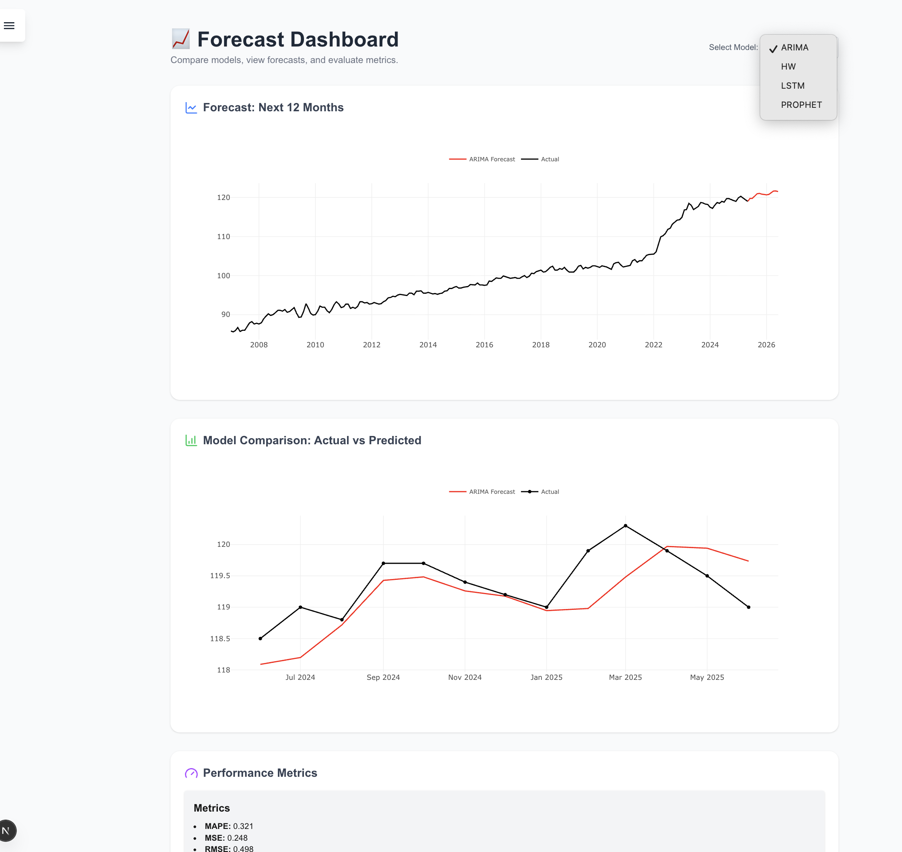

#  Economic Intelligence Platform for Moroccan CPI**

##  **Project Description**

*this project is  an interactive economic intelligence platform .
It analyzes and forecasts the **Consumer Price Index (CPI)** in Morocco using statistical and deep learning models (ARIMA, Holt-Winters, Prophet, LSTM).
The goal is to transform economic data into clear, actionable insights for **decision-making** and **inflation monitoring**.
### Dashboard Preview

  

---

##  **Project Objectives**

* Collect and structure CPI data according to **COICOP classification**.
* Build a **short- and medium-term forecasting pipeline** using hybrid models.
* Identify **similar consumption patterns** through clustering techniques.
* Develop an **interactive web dashboard** to visualize trends, correlations, and predictions.

---

##  **Methodology**

1. **Data Collection & Preparation**

   * Cleaning, interpolation,chaining  and normalization.
   * Mapping COICOP codes to labels.
2. **Exploratory Data Analysis (EDA)**

   * Trend, seasonality, and category correlations.
3. **Predictive Modeling**

   * Model comparison: ARIMA, Holt-Winters, Prophet, LSTM.
4. **Clustering & Visualization**

   * Applying KMeans
   * Visualizing with heatmaps and correlation networks.
5. **Deployment & Interface**

   * Flask API exposing predictions.
   * React dashboard for interactive visualization.

---

##  **Main Features**

*  CPI forecast (short-term).
* Correlation analysis between COICOP categories.
*  Clustering
*  Interactive dashboards with dynamic visualizations.

---

##  **Technologies Used**

| Domain           | Technologies                                   |
| ---------------- | ---------------------------------------------- |
| Languages        | Python, JavaScript                             |
| Backend          | Flask                                          |
| Frontend         | React, TailwindCSS, Plotly.js                  |
| Machine Learning | Scikit-learn, TensorFlow, Prophet, Statsmodels |                               |
| Visualization    | Plotly, Seaborn, Matplotlib                    |

---

##  **Installation and Running**

### 1️ Clone the repository

```bash
git clone https://github.com/aya-lemzouri/Economic-Intelligence-Platform-for-Moroccan-CPI.git
cd Dashboard
```

### 2️ Run the backend

```bash
cd backend
python app.py
```

### 3️ Run the frontend

```bash
cd ../frontend
npm install
npm start
```

### 4️ Access the platform

👉 [http://localhost:3000](http://localhost:3000)


---

##  **Author**

**Aya Lemzouri**


---

